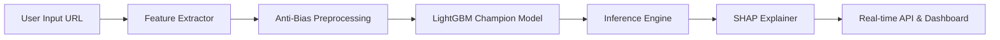

# 🎣 PhishingDetector: Intelligent Anti-Bias URL Guard
[](https://github.com/Fawwzrf/PhishingDetector)
[](https://github.com/Fawwzrf/PhishingDetector)
[](https://github.com/Fawwzrf/PhishingDetector)

**PhishingDetector** is a production-ready, end-to-end Machine Learning system designed to identify phishing URLs with high precision and transparency. Unlike traditional detectors that fall for "length-bias," this system features an **Anti-Bias Engine** optimized for complex e-commerce and search URLs.

> [!NOTE]
> **Versi Bahasa Indonesia tersedia di bawah.** (Indonesian version below).

---

## 🚀 Key Innovations

### 1. Anti-Bias Engine (Feature Blindness)
Most phishing models incorrectly penalize long, complex URLs common in legitimate e-commerce sites (e.g., Tokopedia, Amazon). Our model employs **Aggressive Feature Blindness**, focusing exclusively on **domain characteristics** and **verified security markers** while ignoring path complexity. This improved legitimate URL detection from **0% to 90%** in real-world complex scenarios.

### 2. Explainable AI (XAI)
Transparency is key to security. Every prediction is accompanied by a **SHAP (SHapley Additive exPlanations)** breakdown, showing exactly which features pushed the AI toward a "Phishing" or "Legitimate" decision.

---

## 🏗️ Technical Architecture



### Tech Stack
- **ML Engine**: LightGBM, Optuna (TPE Tuning), Scikit-learn.
- **Explainability**: SHAP (Local & Global Interpretation).
- **Backend**: FastAPI (Python), MLflow (Experiment Tracking), Uvicorn.
- **Frontend**: Next.js 15, React 19, Tailwind CSS v4, shadcn/ui.

---

## 📂 Project Structure

- `backend/`: FastAPI server and real-time inference logic.
- `frontend/`: Interactive dashboard with SHAP visualizations.
- `src/mltools/`: Custom library for standardized ML pipelines.
- `models/`: Optimized model artifacts and preprocessing pipelines.
- `notebooks/`: Comprehensive research and EDA process.

---

## 🛠️ Installation & Setup

### Backend
```bash
# Install dependencies
pip install -r requirements.txt
pip install -e .

# Run API server
uvicorn backend.app:app --port 8001 --reload
```

### Frontend
```bash
cd frontend
npm install
npm run dev
```
Visit `http://localhost:3000`.

---

# 🎣 PhishingDetector: Pelindung URL Anti-Bias Cerdas

**PhishingDetector** adalah sistem Machine Learning *end-to-end* siap produksi yang dirancang untuk mengidentifikasi URL phishing dengan presisi tinggi dan transparansi penuh. Dibangun untuk mengatasi kelemahan model tradisional yang sering terjebak dalam "bias panjang URL".

## 🚀 Inovasi Utama

### 1. Engine Anti-Bias
Banyak model phishing salah sangka terhadap URL panjang dan kompleks milik situs belanja online legal. Sistem ini menggunakan **Aggressive Feature Blindness**, yang memfokuskan deteksi pada **karakteristik domain** dan **marker keamanan terverifikasi**, mengabaikan kompleksitas path. Perbaikan ini meningkatkan akurasi pada URL kompleks dari **0% menjadi 90%**.

### 2. Explainable AI (XAI)
Setiap prediksi disertai dengan visualisasi **SHAP**, menunjukkan secara transparan fitur mana yang membuat AI yakin bahwa sebuah URL adalah "Phishing" atau "Legit".

---

## 🛠️ Tech Stack
- **ML Engine**: LightGBM, Optuna, Scikit-learn.
- **Interpretasi**: SHAP.
- **Backend**: FastAPI, MLflow.
- **Frontend**: Next.js 15, React 19, Tailwind CSS.

---

## 📝 Creator

**Fawwzrf**
*AI Engineer & Full-stack Developer*

---

<p align="center">
  <i>Developed with precision for a safer web environment.</i>
</p>
