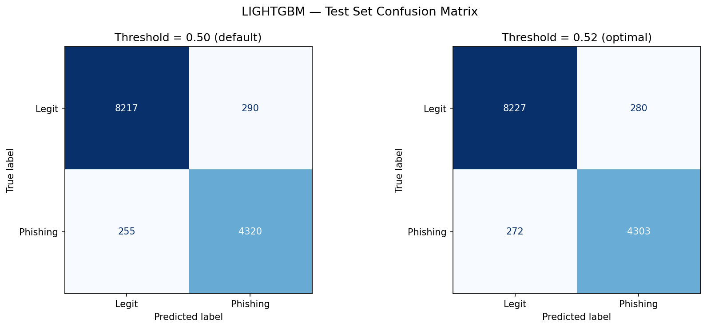
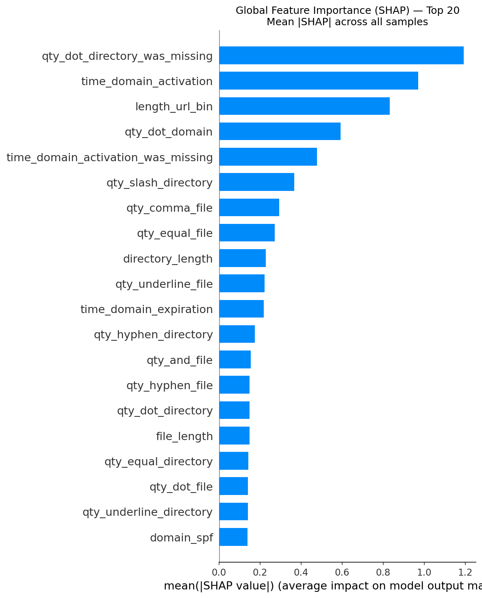
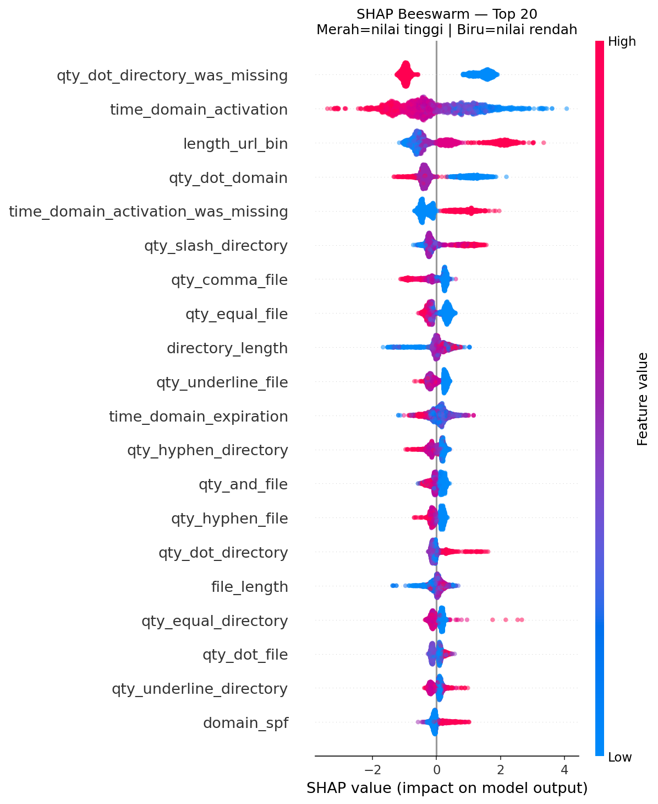

# 🎣 PhishingDetector — End-to-End ML Pipeline

Proyek *Machine Learning* untuk **mendeteksi website phishing** berdasarkan fitur-fitur yang diekstraksi dari struktur URL, informasi domain, dan metadata web. Pipeline ini mencakup seluruh tahapan dari eksplorasi data hingga interpretasi model, dibangun dengan pustaka kustom [`mltools`](README_MLTOOLS.md).

---

## 📊 Ringkasan Dataset

| Informasi | Detail |
|---|---|
| **Sumber** | `data/raw/dataset_full.csv` |
| **Jumlah Sampel** | 88.647 |
| **Kelas Legit (0)** | 58.000 (65,4%) |
| **Kelas Phishing (1)** | 30.647 (34,6%) |
| **Imbalance Ratio** | 1,9× |
| **Tipe Fitur** | Numerik (URL-based, Domain Info) |

Fitur-fitur yang digunakan berasal dari **karakteristik URL** seperti jumlah karakter khusus pada URL/directory/file (titik, slash, underscore, dll.), panjang URL, usia domain, serta informasi keamanan domain (SPF).

---

## 🏆 Hasil Model Terbaik

Model **champion** yang terpilih adalah **LightGBM** setelah dibandingkan dengan Random Forest dan XGBoost, kemudian di-*tuning* menggunakan **Optuna** (TPE Sampler).

### Perbandingan Cross-Validation (ROC-AUC)

| Model | CV ROC-AUC |
|---|---|
| Random Forest | 0.9898 |
| XGBoost | 0.9900 |
| **LightGBM** ✅ | **0.9909** |

### Metrik pada Test Set (Champion — LightGBM)

| Metrik | Skor |
|---|---|
| **ROC-AUC** | **0.9915** |
| **Accuracy** | **95,78%** |
| **F1-Score** | **0.9407** |
| Optimal Threshold | 0.522 |

### Hyperparameter Terbaik (Setelah Optuna Tuning)

| Parameter | Nilai |
|---|---|
| `n_estimators` | 500 |
| `learning_rate` | 0.0285 |
| `num_leaves` | 248 |
| `min_data_in_leaf` | 82 |
| `feature_fraction` | 0.549 |
| `lambda_l1` | 2.85e-06 |
| `lambda_l2` | 2.50e-04 |

### Confusion Matrix

<p align="center">
  
</p>

---

## 🔍 Interpretasi Model (SHAP)

Analisis **SHAP** digunakan untuk memahami fitur mana yang paling berpengaruh terhadap prediksi model.

### Top 5 Fitur Paling Berpengaruh

| Rank | Fitur | Mean |
|---|---|---|
| 1 | `qty_dot_directory_was_missing` | 1.194 |
| 2 | `time_domain_activation` | 0.971 |
| 3 | `length_url_bin` | 0.833 |
| 4 | `qty_dot_domain` | 0.593 |
| 5 | `time_domain_activation_was_missing` | 0.479 |

### SHAP Feature Importance

<p align="center">
  
</p>

### SHAP Beeswarm Plot

<p align="center">
  
</p>

---

## 🔬 Pipeline & Alur Kerja

Proyek ini dibagi menjadi **5 tahap** yang dijalankan secara berurutan melalui Jupyter Notebook / Google Colab:

```
01_eda.ipynb ──► 02_preprocessing.ipynb ──► 03_feature_engineering.ipynb ──► 03_modelling.ipynb ──► 04_interpretation.ipynb
```

| Tahap | Notebook | Deskripsi |
|---|---|---|
| **1. EDA** | `01_eda.ipynb` | Exploratory Data Analysis — distribusi, korelasi, missing values, outlier |
| **2. Preprocessing** | `02_prepocessing.ipynb` | Penanganan missing values, outlier detection & capping, encoding |
| **3. Feature Engineering** | `03_feature_engineering.ipynb` | Seleksi fitur, penghapusan multikolinearitas, transformasi |
| **4. Modelling** | `03_modelling.ipynb` | Training multi-model, Optuna tuning, evaluasi test set |
| **5. Interpretation** | `04_interpretation.ipynb` | SHAP analysis — global & local importance, dependence plots |

---

## 📂 Struktur Direktori

```
PhishingDetector/
├── configs/
│   └── ml_config.yaml           # Konfigurasi seluruh pipeline (preprocessing, modeling, tuning)
├── data/
│   ├── raw/                     # Dataset mentah (dataset_full.csv)
│   ├── interim/                 # Data bersih sebelum feature selection
│   └── processed/               # Data final (X_train, X_test, y_train, y_test .parquet)
├── models/
│   ├── lightgbm_champion.joblib # Model champion yang sudah di-tuning
│   ├── modeling_meta.json       # Metadata hasil training (skor, params, fitur)
│   └── registry.json            # Model registry (versioning)
├── notebooks/                   # Jupyter Notebooks untuk setiap tahap pipeline
├── reports/                     # Grafik hasil (confusion matrix, SHAP plots)
├── src/
│   └── mltools/                 # Library kustom untuk ML pipeline
│       ├── preprocessing/       # Missing handler, outlier, scaler, encoder, selector, splitter
│       ├── modeling/            # Baseline, boosting models, evaluator, tuner
│       ├── interpretation/      # SHAP analyzer
│       ├── data/                # Data loader & EDA
│       └── shared/              # Config, schemas, exceptions, logging
├── tests/                       # Unit & integration tests
├── requirements.txt             # Dependensi Python
├── pyproject.toml               # Build system & project metadata
└── README_MLTOOLS.md            # Dokumentasi internal library mltools
```

---

## 🛠️ Instalasi & Setup

```bash
# 1. Clone repository
git clone https://github.com/Fawwzrf/PhishingDetector.git
cd PhishingDetector

# 2. Buat virtual environment (opsional)
python -m venv venv
source venv/bin/activate       # Linux/Mac
# venv\Scripts\activate        # Windows

# 3. Install dependensi
pip install -r requirements.txt

# 4. Install mltools sebagai package
pip install -e .
```

### Google Colab
```python
!git clone https://github.com/Fawwzrf/PhishingDetector.git
%cd PhishingDetector
!pip install -r requirements.txt -q
!pip install -e . -q
```

---

## ⚙️ Konfigurasi

Semua parameter pipeline dikonfigurasi melalui `configs/ml_config.yaml`:

```yaml
preprocessing:
  missing_values:
    strategy_numerical: "median"
  outliers:
    method: "iqr"
    treatment: "cap"
  feature_selection:
    correlation_threshold: 0.95

modeling:
  metric: "roc_auc"
  n_cv_folds: 5
  tuning:
    n_trials: 100
    timeout: 3600
```

---

## 🧰 Tech Stack

| Kategori | Library |
|---|---|
| Data Processing | Pandas, NumPy, SciPy, PyArrow |
| Machine Learning | Scikit-learn, LightGBM, XGBoost, CatBoost |
| Feature Engineering | Feature-engine, Category Encoders, Imbalanced-learn |
| Hyperparameter Tuning | Optuna |
| Interpretasi | SHAP |
| Konfigurasi | Pydantic, PyYAML |
| Logging | Loguru |

---

## 📝 Creator

Fawwzrf.__

---

<p align="center">
  <i>Proyek ini dikembangkan sebagai implementasi pipeline Machine Learning<br>untuk deteksi website phishing secara end-to-end.</i>
</p>
